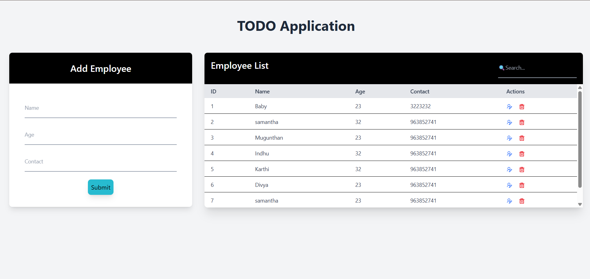
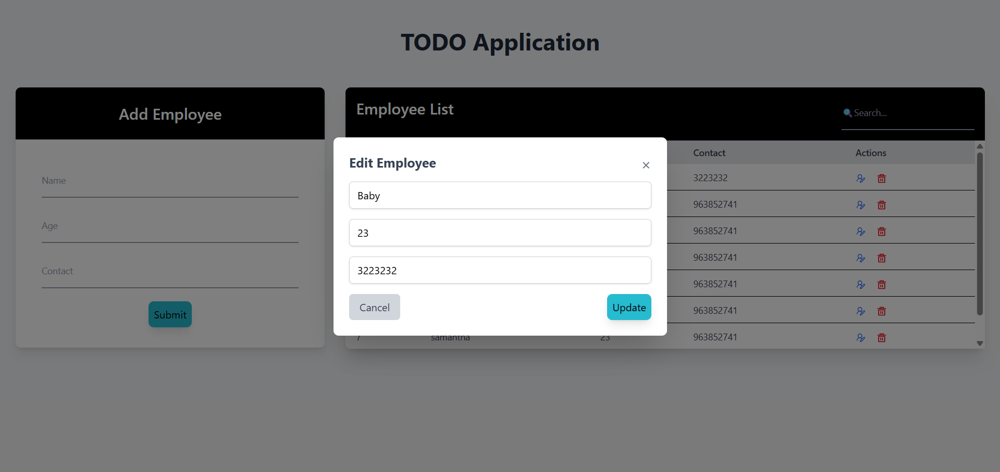
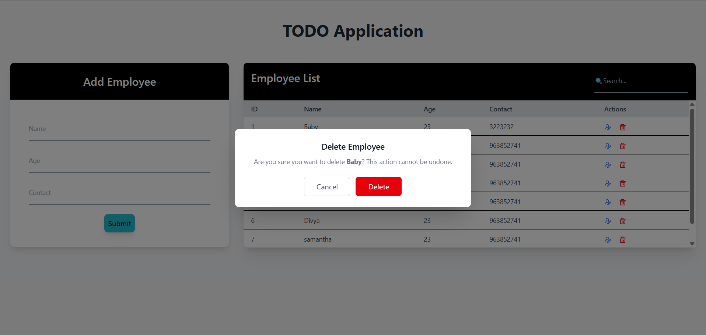
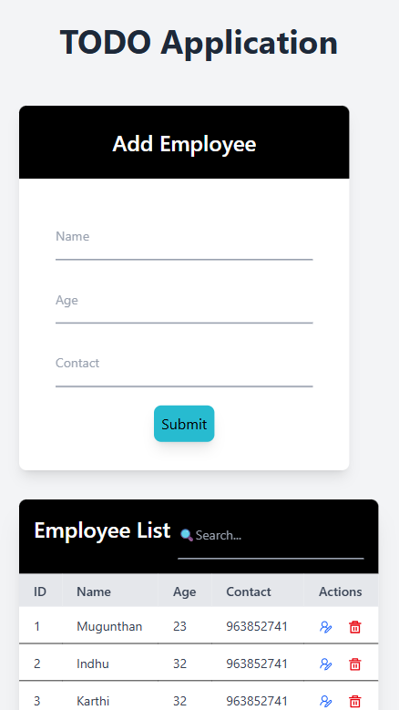

# 🧑‍💼 Employee TODO Application

A modern, responsive full-stack web application for managing employee records with complete CRUD operations.

🔹 CRUD Operations  
🔹 Real-time Search  
🔹 Responsive UI  
🔹 REST API Architecture


## 🚀 Project Links

- 📦 **GitHub Repository:** [https://github.com/MugunthanLIBS/Employee-TODO-Application](https://github.com/MugunthanLIBS/Employee-TODO-Application.git)
- 🚧 **Live Demo:** Not deployed yet

---

## ✨ **Key Features**

### 🔧 **Core Functionality**
- ✅ **Full CRUD Operations** – Add, view, edit, and delete employee records
- ⚡ **Real-Time Search** – Instant filtering across employee data
- 📱 **Fully Responsive Design** – Seamless experience across desktop, tablet & mobile
- 🛡️ **Action Confirmations** – Modal-based delete/edit confirmations to prevent errors
- 📋 **Form Validation** – Client-side validation for data integrity

### 🎯 **Advanced Capabilities**
- 🔄 **RESTful API Architecture** – Clean, scalable backend design
- 📊 **MySQL Integration** – Persistent and reliable data storage
- 🎨 **Modern UI/UX** – Intuitive interface with Tailwind CSS
- ⚙️ **Modular Components** – Reusable React components
- 🔐 **Secure Data Handling** – Protected API endpoints

---

## 🏗️ **System Architecture**

```plaintext
Employee-TODO-Application/
├── 📁 frontend/              # React 18 Single Page Application
│   ├── 📂 src/components/   # Reusable UI Components
│   ├── 📂 src/pages/        # Application Views
│   ├── 📂 src/api/          # API Integration Layer
│   └── 📂 public/           # Static Assets
│
├── 📁 backend/              # Spring Boot 3 REST API
│   ├── 📂 Controller/       # REST Endpoints
│   ├── 📂 Service/         # Business Logic Layer
│   ├── 📂 Repository/      # Data Access Layer
│   ├── 📂 Entity/          # JPA Entities
│   └── 📂 resources/       # Configuration Files
│
├── 📁 screenshots/          # Application Visuals
└── 📄 README.md            # Project Documentation


```
## 📸 Application Screenshots

<div style="overflow-x:auto;">
  <table>
    <tr>
      <td></td>
      <td></td>
      <td></td>
      <td></td>
    </tr>
  </table>
</div>

---

## 🚀 Installation & Setup

### **Prerequisites**
- Node.js (v16 or higher)
- Java JDK 17 or higher
- MySQL 8.0 or higher
- Maven 3.6+
- Git

### **Step 1: Clone the Repository**
```
git clone https://github.com/yourusername/Employee-TODO-Application.git
cd Employee-TODO-Application
```
### **Step 2: Backend Setup**
```
cd backend

# Update application.properties with your MySQL credentials
# Edit: spring.datasource.username and spring.datasource.password

# Run with Maven
mvn clean install
mvn spring-boot:run

# Backend runs on http://localhost:8000
```
### **Step 3: Frontend Setup**
```
cd frontend

# Install dependencies
npm install

# Start development server
npm start

# Frontend runs on http://localhost:5173
```


